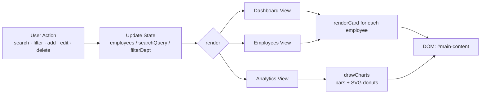

<div align="center">


# EmployeeOS — Employee Profile Generator

**A single-file, zero-dependency HR dashboard** for managing employee profiles, auto-generating employee IDs & AI-style summaries, and visualizing workforce analytics — all in pure HTML/CSS/JavaScript.

[](#)
[](#)
[](#)
[](./LICENSE)
[](#)

</div>

---

## ✨ Overview

EmployeeOS is a self-contained employee management dashboard that runs entirely in the browser — no build step, no backend, no npm install. Open `index.html` and it works. It's built for HR teams, small businesses, or as a portfolio/learning project demonstrating a polished, production-styled front-end built with nothing but vanilla web technology.

## 📸 Preview

<div align="center">

</div>

<div align="center">

</div>

> The images above are illustrative UI mockups generated from the app's actual design tokens (colors, spacing, typography) — open `index.html` in a browser to see the live, interactive version with animations.

## 🚀 Features

| Category | Details |
|---|---|
| 🧑‍💼 **Employee Records** | Add, edit, delete, and view detailed employee profiles with contact info, salary, department, education, and emergency contact |
| 🆔 **Auto-Generated Employee Codes** | Codes like `DEV-2026-JD-001` are generated automatically from department, year, and initials |
| 🤖 **AI-Style Summaries** | Each profile includes an auto-written narrative summary based on role, tenure, and skills |
| 🔍 **Live Search & Filters** | Instant search by name, position, department, or code, plus department/status filters |
| 📊 **Analytics Dashboard** | Salary by department, experience distribution, department headcount and gender diversity donut charts, and a full salary overview — all rendered live in SVG |
| 🎨 **Polished Dark UI** | Glassmorphism header, animated particle background, holographic card hover effects, and gradient accents |
| 📱 **Responsive Layout** | Grid-based layout adapts from desktop down to mobile |
| ⚡ **Zero Dependencies** | No frameworks, no build tools, no package manager — just one HTML file |

## 🗂️ Project Structure

```text
employee-profile-generator/
├── index.html                       # The entire application (markup, styles, logic)
├── assets/
│   ├── banner.svg                   # README header banner
│   ├── screenshot-dashboard.svg     # Dashboard preview graphic
│   └── screenshot-analytics.svg     # Analytics preview graphic
├── LICENSE                          # MIT License
├── .gitignore
└── README.md                        # You are here
```

## 🏗️ Architecture

The app follows a simple, dependency-free render loop: application state lives in a single in-memory `employees` array, and every state change re-renders the active view.



## 🧭 Views

```mermaid
flowchart TB
    subgraph Header
        Nav[Dashboard | Employees | Analytics]
        Add[+ Add Employee]
    end
    Nav -->|Dashboard| Stats[Stat Cards: headcount, avg salary, avg experience, dept count]
    Nav -->|Employees| Grid[Searchable / filterable employee grid]
    Nav -->|Analytics| Charts[Bar charts + SVG donut charts]
    Add --> Modal[Add / Edit Modal Form]
    Grid --> Detail[Profile Detail Modal + AI Summary + QR/Copy]
```

## 🛠️ Tech Stack

- **HTML5** — semantic structure, single entry point
- **CSS3** — custom properties (design tokens), gradients, backdrop-filter glassmorphism, responsive grid
- **Vanilla JavaScript (ES6+)** — state management, DOM rendering, Canvas API (particle background), SVG generation (charts)

No external libraries, no CDN calls, no build pipeline — the entire app is dependency-free by design.

## ▶️ Getting Started

### Option 1 — Just open it
```bash
git clone https://github.com/<your-username>/employee-profile-generator.git
cd employee-profile-generator
open index.html    # macOS
# or double-click index.html in your file explorer
```

### Option 2 — Serve it locally (recommended for consistent behavior across browsers)
```bash
git clone https://github.com/<your-username>/employee-profile-generator.git
cd employee-profile-generator
python3 -m http.server 8000
# then visit http://localhost:8000
```

That's it — no `npm install`, no build step.

## 🧩 Customizing Sample Data

Sample employees are seeded directly in `index.html` inside the `employees` array. Edit that array to change starting data, or use the in-app **+ Add Employee** button to add records at runtime (note: data resets on page reload since there is no backend/persistence layer by default).

```js
let employees = [
  { id:'DEV-2026-JD-001', firstName:'John', lastName:'Doe', dept:'DEV', position:'Data Analyst', salary:75000, /* ... */ }
];
```

## 🗺️ Roadmap Ideas

- [ ] Persist data with `localStorage` or a lightweight backend
- [ ] Export employee data to CSV / PDF
- [ ] Role-based access (admin vs. viewer)
- [ ] Real QR-code generation for profile sharing
- [ ] Dark/light theme toggle

## 🤝 Contributing

Contributions are welcome!

1. Fork the repository
2. Create a feature branch (`git checkout -b feature/my-feature`)
3. Commit your changes (`git commit -m "Add my feature"`)
4. Push to the branch (`git push origin feature/my-feature`)
5. Open a Pull Request

## 📄 License

This project is licensed under the [MIT License](./LICENSE).

---

<div align="center">
<sub>Built with vanilla HTML, CSS & JavaScript — no frameworks required.</sub>
</div>
